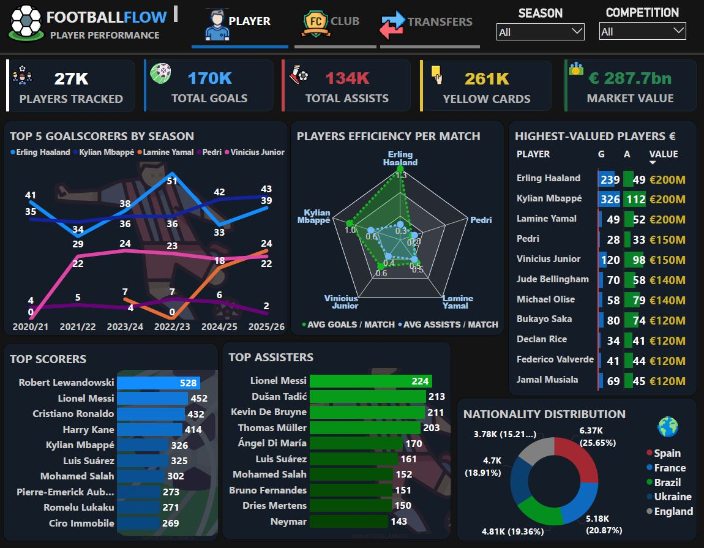
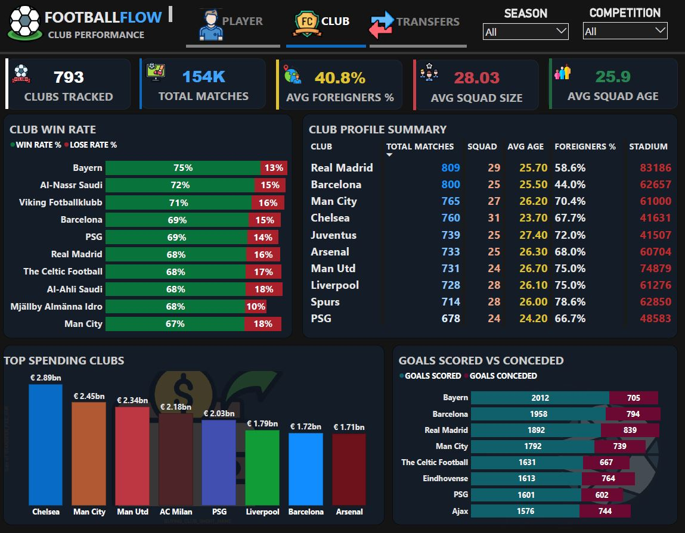
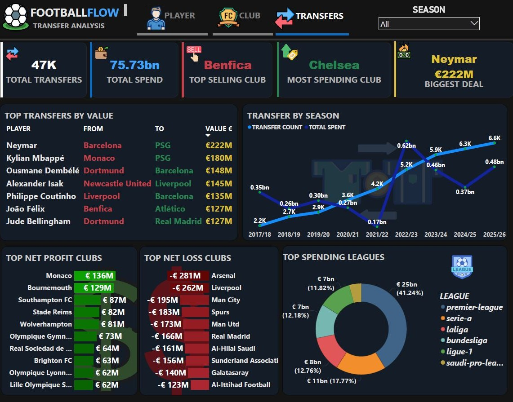

<div align="center">

**End-to-End Football Data Engineering Platform**

*Batch + Real-Time Streaming | Lambda × Medallion Architecture*

---
<br/>

<!-- ── TOOL ICONS — replace each src path with your downloaded PNG ── -->
<table>
  <tr>
    <td align="center">
      <br/>
      <sub><b>AWS S3</b></sub>
    </td>
    <td align="center">
      <br/>
      <sub><b>Snowflake</b></sub>
    </td>
    <td align="center">
       <br/>
      <sub><b>dbt</b></sub>
      <td align="center">
  <br/>
  <sub><b>Kafka</b></sub>
</td>
    </td>
    <td align="center">
      <br/>
      <sub><b>Power BI</b></sub>
    </td>
    <td align="center">
  <br/>
  <sub><b>Grafana</b></sub>
</td>
<td align="center">
  <br/>
  <sub><b>Spark</b></sub>
</td>
  <td align="center">
  <br/>
  <sub><b>InfluxDB</b></sub>
</td>
<td align="center">
  <br/>
  <sub><b>Docker</b></sub>
</td>
    <td align="center">
  <br/>
  <sub><b>Airflow</b></sub>
</td>
  </tr>
</table>


<br/>
</div>


## 🔭 Overview

**FootballFlow** is a production-grade, end-to-end data engineering platform built on real football data from [Transfermarkt](https://www.transfermarkt.com/). It processes a rich relational dataset covering:

<div align="center">

| 📊 1.8M+ | 👤 27K+ | 🏟️ 793 | 💶 47K+ | ⚽ 150K+ |
|:---:|:---:|:---:|:---:|:---:|
| **Appearance Records** | **Players Tracked** | **Clubs Tracked** | **Transfers** | **Matches** |

</div>

This data flows through a fully automated **Batch Pipeline** while simultaneously running an **isolated Real-Time Streaming Pipeline** that simulates live football match events.

> This project was built as a graduation project for the **Data Engineering Track at ITI (Information Technology Institute)**.

### ✨ Key Highlights

| Feature | Description |
|---|---|
| **Dual Pipeline** | Batch and Streaming run fully in parallel and independently |
| **12 Cleaned Tables** | All 12 Transfermarkt CSV tables cleaned with PySpark and stored as Parquet |
| **Galaxy Schema** | Multi-fact dimensional model in Snowflake — fact, dimension, and mart tables sharing conformed dimensions |
| **Live Match Simulation** | Python script replays real game events through Kafka in real time |
| **3 Power BI Dashboards** | Player Performance, Club Analytics, Transfer Analysis |
| **Real-Time Monitoring** | InfluxDB time-series storage with Grafana live dashboards |
| **Full Orchestration** | Entire batch pipeline automated and monitored by Apache Airflow |

---

## 🏗️ Architecture

<div align="center">


</div>

### Two Pipelines, One Platform


---

## 🛠️ Tech Stack

| Layer | Tool | Purpose |
|---|---|---|
| **Source** | Transfermarkt / Kaggle | Raw football data — 12 CSV files |
| **Storage** | AWS S3 | Data lake — Bronze (raw) and Silver (cleaned) Parquet |
| **Batch Processing** | Apache Spark (PySpark) | Clean, cast, transform all 12 tables |
| **Warehouse** | Snowflake | Cloud data warehouse — RAW, STAGING, MARTS schemas |
| **Transformation** | dbt Core | SQL models — staging + galaxy schema marts |
| **Stream Ingest** | Apache Kafka | Message broker for live match events |
| **Stream Processing** | Spark Structured Streaming | Windowed aggregations on live Kafka events |
| **Time-Series DB** | InfluxDB | Store real-time match metrics |
| **Real-Time BI** | Grafana | Live match event dashboards and alerts |
| **Batch BI** | Power BI | Historical analytics dashboards |
| **Orchestration** | Apache Airflow | Schedule, monitor, and alert on batch pipeline |
| **Containerisation** | Docker + Docker Compose | Run Kafka, Airflow, InfluxDB, and Grafana locally |
| **Language** | Python 3.11 | All pipeline scripts, DAGs, and simulators |

---


---

## 🔄 Pipeline Breakdown

### 1️⃣ Bronze Layer — AWS S3

The Bronze layer is the raw data landing zone. All 12 Transfermarkt CSV files are uploaded **as-is** to S3 with no modifications.

```
s3://your-bucket/
└── bronze/
    ├── players.csv
    ├── clubs.csv
    ├── competitions.csv
    ├── games.csv
    ├── appearances.csv
    ├── game_events.csv
    ├── game_lineups.csv
    ├── club_games.csv
    ├── transfers.csv
    ├── player_valuations.csv
    ├── countries.csv
    └── national_teams.csv
```

A verification script (`verify_bronze.py`) confirms all 12 files have landed in S3 before the Silver pipeline starts.

---

### 2️⃣ Silver Layer — Apache Spark

PySpark reads from S3 Bronze, cleans and transforms every table, then writes clean **Parquet** files to S3 Silver. The Silver layer is built in **5 stages**:


#### 🔹 Stage 1 — Data Exploration

Before writing any cleaning logic, explore each of the 12 tables — row counts, schema, null counts per column, and sample rows — to identify exactly what needs to be cleaned.


#### 🔹 Stage 2 — Cleaning Operations

Each table has a dedicated cleaning function covering: trimming strings, safe numeric casting with `try_cast()`, handling sentinel values, dropping duplicates, filling nulls, and filtering invalid ranges.


#### 🔹 Stage 3 — Transformations & Output to S3

Beyond cleaning, several tables receive new derived columns to enrich the dataset:
All cleaned and transformed DataFrames are written as **Parquet** to `s3://your-bucket/silver/<table_name>/`, ready to be loaded into Snowflake.


**Run the full Silver pipeline:**

```bash
cd batch/silver/
python run_all_silver.py
```

---

### 3️⃣ Gold Layer — Snowflake + dbt

Silver Parquet files are loaded into Snowflake via `COPY INTO`, then transformed
through dbt into a **Galaxy Schema (Fact Constellation)** — five fact tables at
different grains sharing a set of conformed dimension tables.


```
Snowflake
├── RAW schema         ← COPY INTO from S3 silver
├── STAGING schema     ← dbt stg_* models (rename, cast, add loaded_at)
├── MARTS schema       ← dbt dim_, fact_, mart_* models (Galaxy Schema)
│   ├── Dimensions: dim_player, dim_club, dim_competition, dim_date
│   ├── Facts:      fact_appearances, fact_matches, fact_transfers,
│   │               fact_player_valuations, fact_game_events
│   └── Marts:      mart_player_performance
│                   mart_club_transfer_spending
│                   mart_club_match_stats
│                   mart_match_events_live
└── SNAPSHOTS schema   ← dbt snapshots (SCD Type 2)
├── snap_player_valuations
└── snap_dim_player
```

**Why Galaxy Schema?** Five fact tables — `fact_appearances`, `fact_matches`,
`fact_transfers`, `fact_player_valuations`, and `fact_game_events` — share the
same conformed dimensions (`dim_player`, `dim_club`, `dim_competition`,
`dim_date`). Each fact sits at a different grain (per appearance, per match,
per transfer, per valuation snapshot, per event), but sharing dimensions lets
Power BI slice player performance, transfers, match stats, and live match
events consistently by the same player/club/competition/date filters.
`fact_game_events` is materialized incrementally and kept isolated so the
streaming pipeline (Kafka) can append to it without touching the other facts.

**Staging layer** handles light renaming, type casting, and adds a `loaded_at`
timestamp to every table for traceability. `stg_games` also derives the
home/away `hosting` and `is_win` logic that replaces the dropped
`club_games` table.

**Dimensions**: `dim_player` carries the player's current market value plus
their *latest* valuation (joined from `stg_player_valuations` where
`is_latest_valuation = TRUE`) as convenience columns — full valuation history
lives only in `fact_player_valuations`.

**Marts layer** contains the aggregated, Power BI-ready business logic, e.g.
`mart_player_performance` aggregates `fact_appearances` by player/season,
`mart_club_match_stats` unpivots `fact_matches` into a home/away club
perspective to compute win rates, and `mart_match_events_live` computes
running goal/card/substitution totals per match from `fact_game_events`.

**Run dbt models:**
```bash
cd football_de

dbt deps                         # install dbt_utils
dbt snapshot                     # SCD Type 2 snapshots (run first)
dbt run --select staging         # 8 staging views
dbt run --select dimensions      # 4 dimension tables
dbt run --select facts           # 5 fact tables
dbt run --select marts           # 4 mart tables
dbt test                         # data quality tests
```

---


### 4️⃣ Streaming Pipeline — Kafka + Spark + InfluxDB + Grafana (+ Snowflake)

The streaming pipeline runs as the **speed layer** of a Lambda Architecture,
alongside the batch pipeline. A Python script replays rows from
`game_events.csv` to simulate a live football match broadcast, and the
resulting time-series metrics are later synced into Snowflake so they can be
combined with historical (batch) data for analysis.

```
Python Simulator
      │
      ▼
Kafka (match_events topic)
      │
      ▼
Spark Structured Streaming
(proccessing, enriching,validation)
      │
      ▼
InfluxDB
(time-series storage)
      │
      ├─────────────────────────┐
      ▼                          ▼
  Grafana                  Copy job → Snowflake
(live dashboards & alerts)   RAW.STREAMING schema
← speed layer output                │
                                     ▼
                          dbt fact_game_events
                          (source_type = 'stream')
                                     │
                                     ▼
                          mart_match_events_live
```

**Start the streaming pipeline:**
```bash
cd streaming/
# 1. Start Kafka
docker-compose up -d
# 2. Start the Spark consumer (in one terminal)
python consumer/spark_streaming_consumer.py
# 3. Start the match event producer (in another terminal)
python producer/match_event_producer.py
# 4. Sync InfluxDB → Snowflake (periodic job)
python sync/influxdb_to_snowflake.py
```

**Events streamed:** `goals` · `cards` · `substitutions` · `shootout`

> **Lambda Architecture in practice:** Grafana reads directly from InfluxDB
> for low-latency, real-time dashboards. In parallel, a sync job copies the
> same streamed events from InfluxDB into Snowflake's RAW/STREAMING schema.
> The `fact_game_events` model (Gold layer) is materialized incrementally and
> unions both the batch-loaded events (`source_type = 'batch'`) and the synced
> streaming events (`source_type = 'stream'`), so `mart_match_events_live` in
> Power BI reflects both historical and live match data.
> 
---

### 5️⃣ Orchestration — Apache Airflow

Apache Airflow schedules and monitors the entire batch pipeline. The DAG runs daily and follows this task sequence:

```
s3_bronze_check  ──►  spark_silver_job  ──►  snowflake_load  ──►  dbt_run  ──►  notify
    (Sensor)         (SparkSubmitOp)       (SnowflakeOp)      (BashOp)    (EmailOp)
```

**Start Airflow:**

```bash
cd airflow/
docker-compose up -d
# Access UI at http://localhost:8080
```

> The Kafka streaming pipeline is **not** managed by Airflow — it runs independently.

---

## 📊 Dashboards

### Power BI — Historical Analytics

Three interactive dashboards connected live to Snowflake MARTS:

<table>
  <tr>
    <td align="center"><b>⚽ Player Performance</b></td>
  </tr>
  <tr>
    <td></td>
  </tr>
  <tr>
    <td>27K players tracked · 170K goals · 134K assists · 261K yellow cards · €287.7bn total market value · Top scorers, assisters, and most valuable players · Nationality distribution</td>
  </tr>
</table>

<table>
  <tr>
    <td align="center"><b>🏟️ Club Analytics</b></td>
  </tr>
  <tr>
    <td></td>
  </tr>
  <tr>
    <td>793 clubs tracked · 150K+ total matches · Win/loss rates per club · Squad profile summary · Top spending clubs · Goals scored vs conceded</td>
  </tr>
</table>

<table>
  <tr>
    <td align="center"><b>💶 Transfer Analysis</b></td>
  </tr>
  <tr>
    <td></td>
  </tr>
  <tr>
    <td>47K+ total transfers · €75.73bn total spend · €222M biggest deal (Neymar) · Top net profit/loss clubs · Transfer volume by season · Spending breakdown by league</td>
  </tr>
</table>

### Grafana — Real-Time Match Monitoring

Live match event stream dashboard powered by InfluxDB. Displays goal timelines, card counts per team, and substitution events in real time as the Python simulator replays match events through Kafka.

<div align="center">


</div>

---

## 🚀 Getting Started

### Prerequisites

| Tool | Version |
|---|---|
| Python | 3.10 or 3.11 |
| Java JDK | 11 (required by Spark) |
| Docker | Latest |
| AWS CLI | Latest |

### 1. Clone the repository

```bash
git clone https://github.com/your-username/FootballFlow.git
cd FootballFlow
```

### 2. Create a virtual environment

```bash
python -m venv venv
venv\Scripts\activate        # Windows
source venv/bin/activate     # Mac/Linux

pip install -r requirements.txt
```

### 3. Configure credentials

```bash
cp config.py.example config.py
# Fill in your AWS and Snowflake credentials in config.py
# config.py is in .gitignore — never commit it
```

```python
# config.py
AWS_ACCESS_KEY = 'YOUR_KEY'
AWS_SECRET_KEY = 'YOUR_SECRET'
AWS_REGION     = 'eu-west-1'
S3_BUCKET      = 'your-bucket-name'
```

### 4. Upload Bronze data

```bash
cd batch/bronze/
aws s3 sync ./data/ s3://your-bucket/bronze/ --include "*.csv"
python verify_bronze.py
```

### 5. Run the Silver pipeline

```bash
cd batch/silver/
python run_all_silver.py
python verify_silver.py
```

### 6. Load to Snowflake and run dbt

```bash
cd batch/gold/
cp profiles.yml.example ~/.dbt/profiles.yml
# Fill in your Snowflake credentials

dbt deps
dbt run
dbt test
```

### 7. Start the Streaming pipeline

```bash
cd streaming/
docker-compose up -d
python consumer/spark_streaming_consumer.py &
python producer/match_event_producer.py
```

### 8. Start Airflow

```bash
cd airflow/
docker-compose up -d
# Visit http://localhost:8080
```

---

## 📦 Dataset

| Property | Detail |
|---|---|
| **Source** | [Transfermarkt](https://www.transfermarkt.com/) via Kaggle |
| **Kaggle Link** | [davidcariboo/player-scores](https://www.kaggle.com/datasets/davidcariboo/player-scores) |
| **Tables** | 12 CSV files |
| **Coverage** | 27K+ players · 793 clubs · 150K+ matches · 47K+ transfers · 1.8M+ appearances |
| **Update Frequency** | Updated regularly on Kaggle |

---

## 📁 Repository Structure

```
FootballFlow/
│
├── 📂 batch/
│   │
│   ├── 📂 bronze/
│   │   └── verify_bronze.py         
│   │
│   ├── 📂 silver/
│   │   ├── 📂 cleaning/
│   │   ├── 📂 exploration/
│   │   ├── spark_session.py         
│   │   └── run_all_silver.py         
│   │
│   └── 📂 gold/
│       ├── dbt_project.yml
│       ├── packages.yml
│       ├── 📂 models/
│       │   ├── 📂 staging/
│       │   ├── 📂 dimensions/
│       │   ├── 📂 facts/
│       │   └── 📂 marts/
│       └── 📂 snapshots/
│
├── 📂 streaming/
│   ├── 📂 producer/
│   │   └── match_event_producer.py   
│   ├── 📂 consumer/
│   │   └── spark_streaming_consumer.py  
│   └── docker-compose.yml           
│
├── 📂 airflow/
│   ├── 📂 dags/
│   │   └── footballflow_batch_dag.py    
│   └── docker-compose.yml
│
├── 📂 dashboards/
│
├── 📂 docs/
│      
└── README.md
```


<div align="center">

**FootballFlow** — *Where data meets the beautiful game.*

⚽ Built with Python · Spark · Kafka · Airflow · Snowflake · dbt · Power BI · InfluxDB · Grafana

</div>
